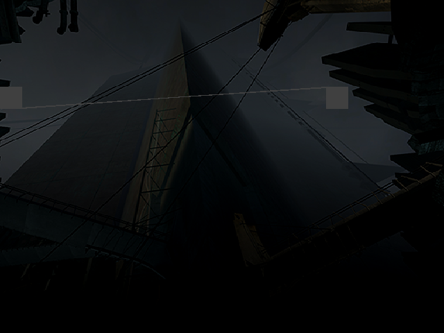

# hl2-recomp

Static recompilation of **Half-Life 2 (Xbox, 2005)** to a native Windows
executable, using [xboxrecomp](https://github.com/sp00nznet/xboxrecomp).

No emulation. The x86 in `hl2_xbox.xbe` is translated to C, compiled with MSVC,
and linked against the xboxrecomp runtime (kernel shim, D3D8 to D3D11, DirectSound,
input).

## Why this target

Every other Xbox recomp target is a stripped binary. HL2 is not — this build
ships with MSVC RTTI left on and Source's name-baking macros intact:

- **2,336** RTTI classes and **2,932** vtables, giving **12,288 unique virtual
  method addresses** with class names and an exact inheritance graph
- **2,743** `typedescription_t` entries, each with a member **name, type and
  byte offset**; 253 `datamap_t` tables recovered *with their C++ class name*
- **1,201 of 1,435** class names (84%) are declared in the **publicly released**
  [Source SDK 2013](https://github.com/ValveSoftware/source-sdk-2013), with an
  exact file to read. The misses are engine internals the SDK omits.
- Feeding RTTI back into the disassembler found **7,992 functions the linear
  sweep missed** — 33,140 to 41,223 function starts (+24%), and the boundary
  work a level load forced took it to **49,498**

So a recovered function can often be traced: address to class name to the real
`.cpp` in the public SDK. Details and caveats in [docs/symbols.md](docs/symbols.md).

## Status

It boots to its own main menu, with no arguments and no map forced — the
engine takes the retail path by itself, reaches `eng->Frame()`, and paints
City 17's skyline out of the title's own textures. It is not playable: the
menu's text does not draw, and nothing is wired to the controller yet.



*`./bin/hl2.exe` with no arguments. 640x480, captured out of the surface the
title's own pushbuffer drew into. The two grey blocks are the menu's widgets,
rasterised in the right place with nothing sampled into them yet.*

| Step | State |
|---|---|
| XBE parsed | done — entry `0x0059C612`, 10 sections, 124 kernel imports |
| RTTI recovery | done — 2,336 classes / 2,932 vtables / 12,288 methods |
| Disassembled | done — **49,498** functions, 91.3% of instructions reachable |
| Datamap recovery | done — 253 classes / 1,722 fields |
| SDK cross-reference | done — 84% of classes located in Source SDK 2013 |
| func_id / codegen | done — 49,487 of 49,498 translated, 13.4 M lines of C |
| Static initialisation | done — all 5,305 constructors run, none faulting |
| Module factories | done — all 13 resolve; material system comes up |
| Display | done — D3D device created, `AvSetDisplayMode` accepted, clears and flips |
| Disc archives | done — decompressed and **byte-verified** (see below) |
| Content load | done — 22.3 MB of a level: map, models, materials, sounds |
| Level load | done — `+map d1_trainstation_01`, 0 faults, 0 unresolved calls |
| First pixels | done — its loading screen, from its own pushbuffer |
| Boot to menu | done — **no command line**; `CModAppSystemGroup::Main` runs `eng->Frame()` |
| Textures | done — the title's own swizzled textures sample; menu text still flat |
| Gameplay | not yet — the load stops short of handing off to the world |

### What actually runs

Run it with no arguments at all and the engine takes the retail boot path by
itself. `CModAppSystemGroup::Main` (`sub_0040EF20`, named by the
`COM_InitFilesystem()` / `eng->Load` / `COM_ShutdownFileSystem()` literals it
still carries) runs `ModInit`, gets `true` back from `eng->Load`, and enters
the loop at `sub_0040ED00`:

```c
while (eng->GetState() != DLL_CLOSE) {   /* eng = 0x008095D0, vtable[0x34] */
    pump();                              /* sub_00595F30, owns "quit"      */
    eng->Frame();                        /* vtable[0x14]                   */
}
```

On the way it enumerates `maps/*.bsp`, reads its own `cfg/continue.cfg` and
`cfg/xboxuser.cfg` off the HDD partition, and sets its display mode. Nothing
here is driven from outside: no map is forced, and `RECOMP_CMDLINE` is unset.

What it draws is the main menu. About 9,900 draws and 89,600 indices a frame
go into alternating back buffers at `0x00B98000` and `0x00A6C000`, and the
background is City 17's skyline sampled from the title's own swizzled
textures. The menu's text and panels still come out as flat blocks, and the
scanout buffer stays black — the flip does not reach it yet.

Given `-retail +map d1_trainstation_01` instead, it selects the `Z:/HL2/`
content root, mounts `zip0_xbox.xzp`, reads the 19,767-entry directory, opens
the `.bsp` and pulls 22.3 MB of models, materials, physics and sounds out of
it — far enough to be loading character models — without a fault or an
unresolved indirect call.

It draws that too. The title submits a real NV2A command stream (`SET_BEGIN_END`,
`ARRAY_ELEMENT16`, and a `SET_FLIP_READ` per presented frame), and executing it
puts 2,336 draws and 42,942 indices per frame into the back buffer at plausible
screen coordinates. The result is HL2's loading screen: the grey dialog panel,
the title bar, and the orange segmented progress bar, in the title's own
colours.

What it does not do is finish. The load reaches a plateau and stops — no
further I/O, no kernel calls, the progress bar identical minutes apart — while
the engine keeps rendering. Two intermittent failures remain, roughly one run
in ten each: a `-1` free-list sentinel dereferenced in the title's own
allocator, and an engine lock acquired and not released. Both are characterised
in [docs/boot.md](docs/boot.md).

Command-line arguments reach the title the way the console's launcher passes
them, through the launch-data page:

```bash
RECOMP_CMDLINE="-retail" ./bin/hl2.exe
```

The menu needs none of it. To see what the engine draws for itself:

```bash
RECOMP_PB_EXEC=1 RECOMP_FB_DUMP=frame ./bin/hl2.exe   # frame000.bmp, ...
```

`RECOMP_PB_EXEC` executes the pushbuffer and `RECOMP_FB_DUMP` writes the
surface being drawn into, which on a double-buffered title is not the one
`AvSetDisplayMode` named. `HL2_FB_DUMP` writes that other one — what is on
screen — and finds its address from the title rather than assuming it.

### The disc archives

The disc ships `.xz_`, the game reads `.xzp`, and `default.xbe` converts one to
the other. Rather than reimplement LZX, **the loader is recompiled too and its
own decompressor is called** — the console's code, doing the console's job:

```bash
./tools/install_hdd.sh
```

Verification matters more than it looks. An extraction can have the right
magic, the right footer, the exact declared length and 19,842 plausible
filenames and still be wrong — the first one had 165,448 zeroed bytes in it.
XZP stores many files twice, so the archive checks against itself with no
reference needed, and `install_hdd.sh` refuses to leave a bad extraction in
place.

### Fixes this target pushed upstream

The point of a hard target is what it finds. Each of these was a silent
miscompile in [xboxrecomp](https://github.com/sp00nznet/xboxrecomp) affecting
any title, found here because HL2 exercised it:

- **Forward `rep movs` lowered to `memcpy`** — the hardware copies one element
  at a time, so an overlapping forward copy propagates, which is how every LZ
  decoder emits a run. Output kept its exact length and lost 165,448 bytes.
- **`bt`/`bts` on memory masked the bit offset** — with a memory bit base the
  offset indexes a bit *string*. Masking it folds MSVC's 256-bit `strpbrk` map
  onto one dword, so `'?'` and `'_'` alias and every path with an underscore
  looked like it held a wildcard.
- **Carry flag dead after arithmetic** — `jb`/`jae` only read real flags after
  a `cmp`; after arithmetic they fell back to a variable nothing assigns, so
  the branch was always false. MSVC's bit readers are built on that shape.
- **Tail calls did not end a function** — `ret` before int3 padding started a
  new function, a `jmp` did not, so a real function was swallowed and indirect
  calls into it were skipped rather than made. Found 837 more functions.
- **Frames built by `__SEH_prolog`** were classified frameless, so they never
  re-published their frame and `__finally` funclets ran against a dead one.
- **An SSE compare read a register the next line overwrote** — `comiss` was
  emitted as a comment and rebuilt at the consuming branch, by which point a
  `lea` had reused the operand. 19 of this image's 12,617 float compares have
  that shape, and each is silently fatal.
- **`swizzle_offset` addressed one texel column for every row** — it spread
  both coordinates onto even bit positions and masked, so the Y term was almost
  always zero: 261,632 of 262,144 coordinates collided at 512x512. It had never
  had a caller until a per-pixel sampler needed one. Now a bit deposit against
  the same masks the row-walking unswizzler uses, with a test that checks the
  two agree texel for texel.
- **Swizzled textures were unsamplable three ways** — a texture stage needed a
  pitch to be valid and a swizzled texture has none, its size lives in the
  format word rather than in `SET_TEXTURE_IMAGE_RECT`, and its coordinates are
  normalised rather than in texels. Swizzled is the Xbox default, so this was
  every texture the title had.
- Plus `FscGetCacheSize`/`FscSetCacheSize`, `RtlCompareMemory`, the arity
  of `NtWaitForMultipleObjectsEx`, `rdtsc`, and the AV pack encoding.

## Setup

You need your own copy of the game. Nothing redistributable is in this repo.

```bash
# 1. extract the disc next to this README
7z x 'Half-Life 2 [!].7z' -ogame && mv 'game/Half-Life 2'/* game/

# 2. reference source (optional but recommended, ~610 MB, gitignored)
git clone --depth 1 https://github.com/ValveSoftware/source-sdk-2013 ref/source-sdk-2013

# 3. run the pipeline
./regen.sh --disasm

# 4. sanity-check the symbol recovery
py -3 tools/rtti.py --self-check
py -3 tools/datamaps.py --self-check
py -3 tools/xcmp.py --self-check
py -3 tools/xzp_verify.py --self-check

# 5. build, install the archives, run
cmake -S . -B build-msvc && cmake --build build-msvc --config Release
./tools/install_hdd.sh
RECOMP_CMDLINE="-retail" ./bin/hl2.exe
```

Requires Python 3.10+ with `capstone`, Visual Studio 2022, CMake 3.20+, and an
`xboxrecomp` checkout at `../xboxrecomp`.

## Layout

```
config/   runtime-discovered function seeds (committed: cannot be re-derived
          without running the game)
docs/     findings
game/     your extracted disc                    (gitignored, all of it)
build/    everything derived from the XBE        (gitignored)
ref/      reference source checkouts             (gitignored)
src/      entry point + generated C              (gen/ gitignored)
tools/    HL2-specific analysis
```

**No game data is committed.** Not the XBE, not the assets, and not anything
extracted from them — the section table, the 12,288 RTTI-derived function
addresses and the 11,520 recovered class names all live in `build/` and are
regenerated by `regen.sh` in seconds. The one exception is
`config/seed_functions.json`, which holds addresses a *run* discovered and that
no static pass can find again.

## License

MIT, see [LICENSE](LICENSE). Applies to the code in this repository only.
Half-Life 2 and the Source engine are Valve's; you must provide your own copy
of the game.

See [CLAUDE.md](CLAUDE.md) for the full XBE analysis, disc layout, and known risks.
