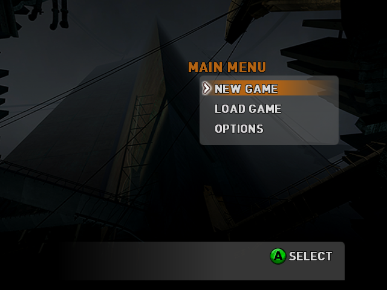

# Boot path

Notes on the engine's own startup, recovered while driving the recompiled
binary far enough to render. Addresses are `hl2_xbox.xbe` VAs.

## The static-link factory table

The Xbox build has no DLLs -- every Source "module" is linked into the one
image -- so the port replaces `LoadLibrary`/`GetProcAddress` with two static
registries.

### `sub_00595A30` -- `InterfaceReg::InterfaceReg(name, value)`

384 callers, all in the `0x005C7Axx` static-initialiser band. Pushes a
`{ name, value, next }` node onto the list headed at `0x009A9DEC`:

```
mov  edx, [esp+8]          ; value
mov  eax, ecx              ; this (the node, a static)
mov  ecx, [esp+4]          ; name
mov  [eax],   ecx
mov  [eax+4], edx
mov  ecx, [0x9A9DEC]
mov  [eax+8], ecx
mov  [0x9A9DEC], eax
ret  8
```

The nodes are statics, so the list only exists once the C++ constructors have
run -- which makes this registry a direct read-out of whether static init
worked.

### `sub_00595B50` -- `Sys_GetFactory(module_index, symbol)`

The lookup side. Only `"CreateInterface"` (the string at `0x0065DE90`) is a
legal symbol; anything else returns 0 immediately. `module_index` must be in
`1..13`, and indexes an 8-byte-stride table at `0x0081591C` whose first field
is the module's name. It then walks `0x009A9DEC` comparing that name and
returns the matching node's value.

`sub_005A1960` is the one-argument wrapper: it substitutes
`"CreateInterface"` for the symbol and tail-jumps here, so its `ret` is
`sub_00595B50`'s -- a plain `ret`, no argument cleanup.

### The module table at `0x0081591C`

| idx | name | idx | name |
|---|---|---|---|
| 1 | `FileSystem_Stdio` | 8 | `VPhysics` |
| 2 | `MatSys` | 9 | `gameui` |
| 3 | `VguiMatSurface` | 10 | `client` |
| 4 | `VguiDLL` | 11 | `Game` |
| 5 | `ShaderDX8` | 12 | `SoundEmitterSystem` |
| 6 | `StudioRender` | 13 | `datacache` |
| 7 | `Engine` | | |

Index 0 is not a module: the range check is `1 <= idx < 14`.

That list is the shape of the boot -- filesystem first, then materials and
the shader backend, then the engine, then the game DLLs. A module whose
factory does not resolve is a module that never registered, which means its
constructors did not run.

## `sub_005A1700` -- the dispatch that consumes a factory

Reached from `sub_005C0AE0` via `sub_005A17A0`, off the `WinMain` region at
`sub_005C0F0A`. Given a record index it reads a 12-byte record from
`[this+4]`:

```
rec[0] != 0  ->  ecx = rec[0]; call sub_005A1960   ; resolve by module index
rec[0] == 0  ->  eax = rec[1]                      ; use the stored pointer
                 call eax                          ; unconditionally
```

The `call eax` is not guarded, so a factory that fails to resolve is a call
through a null pointer. On hardware that faults; under the recompiler it took
the indirect-call failure path instead, which is how it surfaced.

Note the calling convention: the target takes `ecx`/`edx` only, with nothing
pushed, so it must end in a plain `ret`. See `docs/upstreaming.md` for the
recompiler bug this exposed.

## The content pipeline

The game reads `.xzp`; the disc ships `.xz_`. Those are not the same file
under two names.

`.xz_` is an **`xCmp` container** -- Microsoft XCompress, i.e. LZX:

```
magic  'xCmp'          uncompressed  434,653,523 (414.5 MB)
version 1              window        0x80000 (512 KB)
                       block         0x4000  (16 KB)
```

`zip0_xbox.xz_` is 253 MB on disc, a ratio of 1.72. `default.xbe` carries the
`xCmp` magic and both extensions; `hl2_xbox.xbe` knows only `.xzp`. So the
loader decompresses during its copy, and renaming produces a file the game
cannot parse -- which fails late and confusingly, as the engine hunting
`gameinfo.txt`, `valve.rc` and the whole `cfg` tree and eventually parsing a
string as a pointer. `tools/install_hdd.sh` refuses rather than pretending.

### Recompiling the loader

`regen_loader.sh` and `src/loader/` build `default.xbe` as a second target,
so the decompressor the console used does the work instead of a
reimplementation of LZX. It is small enough to make that cheap: **1,430
functions and 161 K lines of C, generated in under three seconds**, against
the game's 48,335 and 14.9 M.

What works: it loads, runs its CRT, brings up D3D, reads
`LoaderMedia/install.txt`, resolves `Z:` to `saves/Cache`, enumerates the
destination `.xzp`/`.mrk` paths, and reads all six source archives' 24-byte
`xCmp` headers. Every step of the install *scan* is correct.

Note the marker: the manifest's first line is labelled "Must Be First, Change
target to force a recopy" and maps `install.txt` to `Z:\version_235.txt`. The
loader compares them and skips the whole install when they match, so writing
that file by hand makes a later run decide there is nothing to do. It is the
loader's to write, once it has actually copied.

### Where it stops

The attract loop drives the install through the object's own vtable:

```
mov eax,[esi]; mov ecx,esi; call [eax+4]     ; sub_00013AE0
mov edx,[esi]; mov ecx,esi; call [edx+8]     ; sub_00013F70
```

with the vtable the constructor installs at `0x0006F928`:
`{ 0x00014060, 0x00013AE0, 0x00013F70, 0x00014DC0 }`. `sub_00014060` is slot
0 -- the install *step*, called by the other two, not instead of them.

At runtime `this` is `0x00F7DC90` and its vtable reads **0**. The memory
around that pointer is return addresses (`0x0001443A`, `0x0001444B` -- the
call sites in `sub_00014420`), so the pointer is inside the frame rather than
at the 0x22AC object the frame is supposed to hold. The prime suspect is the
large-allocation path of `_chkstk` (`sub_0001D520`, taken for sizes >= 0x1000,
which 0x22AC is): it must move `esp` down by the requested amount, and the
object clearly is not where the code expects it.

Driving the install without the loop does not avoid this -- the same wrong
object is passed -- and calling the constructor directly is worse, because it
skips the loader's CRT and faults immediately.

That frame-arithmetic bug turned out to be a disassembler one, now fixed
upstream: the linear sweep drifts through XPP's zero padding and decodes
001C950600558D at 0x00069533, swallowing the `push ebp` at 0x00069538 that
sub_0006A204 tail-jumps to. The seed for it was rejected as
"mid-instruction", the target stayed stubbed, and a stub returns without the
callee's `ret 8` -- so esp walked off by 4 per call and the object pointer
slid 8 bytes out from under its own vtable. Accepting a mid-instruction seed
when it decodes as a prologue fixes it, and Half-Life 2 is unchanged by the
rule (49,498 functions either way).

With that and the loader's own GPU fence registered (its device global is
0x00034048, the equivalent of the game's 0x0061EDE8), the loader runs its
real attract loop and reaches video playback -- which never completes. That
is where the loader route stands: everything up to and including the install
scan works, and XMV is the remaining blocker. Removing the videos does not
help; the stall persists with the files absent, so it is the subsystem rather
than the file, and Title_Load.xmv is itself a copy target.

## The xCmp container

Reversed from the file, then confirmed against the loader's own walker. The
spec below is exact: it accounts for every byte of zip0_xbox.xz_ (253 MB on
disc) and produces the 434,653,523 bytes the header claims, in 26,530 blocks.
`tools/xcmp.py` walks and checks it.

| | |
|---|---|
| header | 24 bytes: `'xCmp'`, version 1, uncompressed size, window 0x80000, field4 0x00390080, block 0x4000 |
| record | `{ uint16 length; payload[length] }`, next at `+2+length` |
| chunk | one 0x80000 window, zero-padded at the end |

24 bytes is not a guess: it is what default.xbe's own header check reads
(`sub_00011F10` reads 0x18 and compares the magic and version).

The length field is a discriminator as much as a size, which is the part that
resisted a read of the file alone:

| length | meaning |
|---|---|
| `0x0000` | padding. The rest of this chunk is zero; the next record is at the next window boundary. |
| bit `0x8000` set | a **stored** block. The low 15 bits are its size, so the record is `2 + size` and the payload is already the output. |
| anything else | a **compressed** block of `length` bytes, opening with a six-byte sub-header `{ uint16 0x434A, uint32 output size }`, then LZX. |

Reading the file bottom-up nearly got there and then stalled, because the
stored records all carry `0xC000` and taking that as a length walks 4 bytes
off per block -- after which the framing never recovers. `sub_00011000`, which
is the walker, settles it in nine lines:

```
len = *(uint16 *)src;
if (len == 0)      break;                                 end of chunk
if (len & 0x8000)  memcpy(dst, src + 2, len & 0x7fff);     stored
else               dst += sub_0001CE74(src + 2, dst);      compressed
```

so `0xC000` is `0x8000 | 0x4000`: a stored block of one 16 KB block. In
zip0_xbox.xz_, 25,894 blocks are compressed and 636 stored.

Chunks are independently decodable -- LZX back-references never cross a
window -- so the whole 414 MB never has to be resident. The largest chunk
produces 3,735,552 bytes.

### Decompressing with the console's own decoder

No LZX implementation was written. `sub_0001CE74` is the block decoder, it is
a pure function of `(src, dst)` touching no globals, and it is already
recompiled along with the rest of default.xbe -- so the install runs it:

```
./tools/install_hdd.sh              # or:
./bin/hl2_loader.exe --extract game/GameMedia/zip0_xbox.xz_                                 saves/Cache/hl2/hl2x/zip0_xbox.xzp
```

`--extract` maps the XBE (the decoder reads static tables out of its own
`.rdata`), then feeds `sub_00011000` one chunk at a time with a 512 KB source
buffer and an 8 MB destination. It does not need the loader to boot, which is
what makes this route work while the attract loop is still stalled on XMV.

The output begins with `piZx` and ends with the `xZfT` footer, at exactly the
length the header states.

**That is not sufficient verification, and believing it was cost a day.** The
first extraction matched magic, footer and length exactly, listed 19,842
plausible filenames, and was still wrong: 165,448 bytes in it were zeros where
real bytes belonged, spread over 352 of the 26,530 blocks. Length is preserved
by the bug, so every cheap check passed.

What catches it is that the archive stores many files **twice** -- once in the
preload block and once as a file -- so the two copies can be compared against
each other with no external reference:

```
compared 390 duplicated files: 0 mismatching, 0 differing bytes
```

Before the fix that read 383 mismatching of 415. `tools/xcmp.py --self-check`
covers the framing; this pair check is what covers the payload, and it is the
one worth running after any change to the decoder.

The cause was not in the container or the decoder at all. Forward `rep movs`
was being lowered to `memcpy`, and the LZ run -- a match of distance 1 and
length N, repeating one byte N times -- is precisely an overlapping forward
copy whose destination reads what it has already written. `memcpy` is
undefined there. Fixed upstream in `0283b5a`; see [upstreaming.md](upstreaming.md).

**This took a toolkit fix to work at all.** `sub_0001CE74` is a bit reader:
`add edx, edx` shifts the top bit into the carry and `jae` tests it. Carry
conditions were only lowered when the flags came from a `cmp` -- after
arithmetic they fell back to a `_flags` variable nothing ever assigns, so the
branch was permanently false and the decoder read a garbage pointer on its
first block. Three related gaps, all fixed upstream:

- `jb`/`jae` after `add`/`sub`/`adc`/`sbb`/shifts now read `_cf`, which the
  lifter already computed beside the write.
- That rule runs *before* the per-mnemonic reconstructions, which compute CF
  from the operands after the write and are therefore wrong whenever the
  destination is also the source -- `add edx, edx` became `edx < edx`.
- At a block boundary the flag tracking resets, since the predecessor is not
  known. `_cf` survives that: it is a real variable, so the fallback reads it
  rather than `_flags`.

`_cf` is still only declared where something consumes it; the translator now
recognises a carry-consuming branch as a consumer, not just `adc`/`sbb`.

## What the engine renders

It reaches its own main loop. `CModAppSystemGroup::Main` is `sub_0040ED00`:

```
while (engine->GetQuitting() == 0)   ; [vtable+0x34], sub_0040F490
    engine->Frame();                  ; [vtable+0x14], sub_0040F4E0
```

on the static `CEngine` at 0x008095E0 (RTTI-confirmed, base `IEngine`). Most
iterations return early because the frame limiter says "not yet"; roughly
1,650 in 100 seconds do real work, which is a sane rate rather than a spin.

Each of those frames clears and flips. The command stream is real -- 1,457
segments, 25,608 words, 295 distinct methods, none unrecognised by the
scanner -- and includes `CLEAR_SURFACE`, `SET_COLOR_CLEAR_VALUE`,
`SET_TRANSFORM_PROGRAM`, and depth/blend/cull state.

**It issues no draw calls.** No `NV097_SET_BEGIN_END` (0x17FC) appears
anywhere in the stream, no vertex data methods, and the executor counts
`draws 0, 0 indices`. The engine is clearing to opaque black (0xFF000000) and
presenting empty frames, because it has no materials to draw with.

That the clear reaches the screen is not an assumption: `RECOMP_RASTER_TEST`
draws one known triangle after each clear, and it lands in the window at
exactly its own area -- 75,264 of 307,200 pixels for
(320,72) (544,408) (96,408). Executor, surface addressing, framebuffer window:
all working.

### Addressing, which is what made this hard to see

`NV097_SET_SURFACE_COLOR_OFFSET` and `AvSetDisplayMode` both report *physical*
addresses. Guest VA and physical are the same number in this runtime, so
reading them as VAs works until it does not: Half-Life 2's framebuffer is at
physical 0x84000, which as a VA is inside the loaded image. The executor
refused to write there (correctly), and the framebuffer window was displaying
the game's own code as pixels. Both now resolve through XBOX_CONTIG_BASE,
where MmAllocateContiguousMemory actually put the buffer.

### On fabricated config files

Empty stand-ins for `cfg/*.cfg` are worse than absent ones: the engine opens
one, takes a garbage size from it, and issues a 16 MB read that ends in
STATUS_END_OF_FILE. They also do not help -- the engine's behaviour is
identical without them. Removed.

### The content path, end to end

With the archives installed the engine's own search machinery came into view,
and it turned out the last blocker was not content at all.

**How the game names its content.** Three roots are registered, and the choice
between the last two is a runtime flag:

```
mov  ecx, 0x76fac0   ; "R:/HL2/"     always
mov  al,  [0x9aa324]
test al, al
mov  ecx, 0x76fab8   ; "T:/HL2/"     flag == 0
je   .done
mov  ecx, 0x76fab0   ; "Z:/HL2/"     flag != 0
```

`R:` is not a drive. Nothing in either XBE links `\\??\\R:`, and none is needed:
`R:/HL2/` is a prefix HL2 registers with its own file layer, and
`sub_00596B70` classifies a path by matching it against the registered
prefixes before rewriting it onto the real root. So `r:\\hl2\\hl2x\\zip0_xbox.xzp`
becomes `Z:\\HL2\\hl2x\\zip0_xbox.xzp`, which is exactly where
`install.txt` puts it.

The flag is set by a 64 MB memory check -- a retail console rather than a
devkit -- or by `-retail` on the command line, alongside `-dev` and
`-novxconsole`. `RECOMP_CMDLINE="-retail"` pins it, which is worth doing rather
than depending on what this runtime reports for memory size.

**Why it still found nothing.** The pack scan ran, built the right names, and
rewrote them to the right root, yet no `.xzp` ever reached the file layer.
`sub_0041E650` probes each candidate with the CRT's `stat`, and `stat` rejects
a path containing a wildcard before it opens anything:

```
push 0x7714ac     ; "?*"
push esi          ; the path
call strpbrk
test eax, eax
jne  .enoent
```

`Z:\\HL2\\hl2x\\zip0_xbox.xzp` has no wildcard, and it was rejected anyway.
MSVC's `strpbrk` is a 256-bit character map on the stack:

```
push 0 x8                  ; eight zero dwords
bts  dword ptr [esp], eax  ; per character of the set
bt   dword ptr [esp], eax  ; per character of the string
jae  next
```

A memory bit base is a **bit string**: the operand addresses the byte holding
bit 0 and the offset runs over the whole string, so the hardware takes the
dword at `base + (offset/32)*4` and bit `offset%32`. The lifter masked the
offset to 31 -- correct for a register bit base, where the offset really is
modulo the operand size -- which folded all eight dwords onto the first. The
map then aliased mod 32, and `'?'` (0x3F) set the very bit `'_'` (0x5F) tests.

So every path with an underscore was "contains a wildcard". The archives are
`zip0_xbox.xzp` and `zip0_xbox_english.xzp`. Paths without one -- the engine's
`materials\\debug\\debugmrmwireframe.vmt` and friends -- opened normally, which
is why this read as a content problem for so long rather than a string one.

Fixed upstream in `5633c13`, both the standalone lift and the fused `bt`+`jcc`,
since the testing loop is `bt [esp], eax` fused with the `jae` after it. An
immediate offset really is limited to 0..31 of the addressed dword and keeps
the simple form.

Two smaller gaps came out of the same investigation, in `195113e`:
`FscGetCacheSize`/`FscSetCacheSize` had no bridge, so a title that saves the
cache size and restores it was restoring zero; and the missing-bridge warning
could not tell a genuine zero-argument function from an ordinal nobody had
written down, so it accused `FscGetCacheSize` of corrupting the stack when it
was fine. That false alarm cost an hour of this investigation, which is reason
enough to fix it.

### Loading a level

The engine's main loop runs whether or not there is anything to draw:
`CModAppSystemGroup::Main` alternates `engine->GetQuitting()` (`sub_0040F490`)
and `engine->Frame()` (`sub_0040F4E0`) indefinitely -- hundreds of millions of
indirect calls in a two-minute run. A frozen-looking process here is not
necessarily stuck; check the indirect-call counter before concluding it is.
`RECOMP_WATCHDOG_SECS` prints the recent targets and answers it immediately.

Telling it to load a level changes everything:

```bash
RECOMP_CMDLINE="-retail +map d1_trainstation_01" ./bin/hl2.exe
```

and the map opens **off the DVD**, exactly where the console reads it:

```
[PATH] \\Device\\CdRom0\\GameMedia\\maps\\d1_trainstation_01.bsp
[FILE] -> 0x00000000
```

Nothing needs staging for this. `install.txt` copies only the archives and the
logo video; the 90 `.bsp` files stay on the disc and are read from `D:`. An
earlier attempt to hard-link 424 MB of them into the HDD path was solving a
problem that does not exist.

### The shape of the remaining work

Each step into the level load has been the same failure, and it is worth
naming because the symptom never looks like the cause: **an indirect call
whose target is not a known function is skipped rather than made.** The call
does not fault and nothing is logged at the call site; the callee simply does
not run, `eax` keeps whatever it held, and the caller uses that as a return
value. It surfaces later as a string used as a pointer, or a size, or a
handle.

The runtime does say so -- `[ICALL] Failed to resolve VA ...` -- and that line
is the most useful single thing in the log. Three separate detection gaps have
turned up this way, each one a different reason a real function was invisible:

| Missed because | Fix |
|---|---|
| A tail call ended the function, and only `ret` was recognised before padding | `8977353` |
| An MSVC vcall thunk ends in an indirect jump and never reaches a `ret` | `c8ab437` |
| A function began immediately after a `ret` with no padding at all | `666ac54` |

`config/seed_functions.json` exists for what no static pass can find, and has
ten entries. Prefer a rule when the misses share a shape -- all three above
did.

### What is left

Every indirect call in a level load now resolves, and nothing faults:

```
default (real locks)   3 runs: 0 faults, 0 unresolved calls
RECOMP_CS_MODE=single     run: 0 faults, 0 unresolved, 14.3 MB of level content
```

Getting there took five separate detection fixes, all found through the same
signal -- `[ICALL] Failed to resolve VA` -- and all invisible for a different
reason:

| Missed because | Fixed by |
|---|---|
| A tail call ended the function; only `ret` counted before padding | rule, `8977353` |
| A vcall thunk ends in an indirect jump, never reaching a `ret` | rule, `c8ab437` |
| A function began right after a `ret` with no padding | rule, `666ac54` |
| Its frame is built by `__SEH_prolog`, so there is no prologue | rule, `025b69e` |
| `mov <reg>, imm32; ret` -- a constant accessor with no frame at all | rule |
| `mov ecx, imm32; call` -- a thiscall stub | **seed** |

The last one is a seed on purpose. That shape occurs 13,359 times in this
image and 12,464 of those are mid-function, so a pattern loose enough to catch
the one that matters would split functions. The line between the two
mechanisms is whether the shape occurs inside functions: a rule when it does
not, a seed when only a run can say which instance is real.

**Why an unresolved call is worth this much trouble.** It does not fault and
nothing is logged at the call site. The callee simply does not run, and the
arguments already pushed for it stay on the stack. That shifts the caller's
frame, so its `pop ebx` restores the wrong slot, and the corrupted value is
passed on as an array index. The fault lands three functions away in code that
had nothing to do with it. `-DRECOMP_ABI_CHECK` is what makes this tractable:
it names every function returning with a callee-saved register altered, and
that list led straight back to the two skipped calls.

**The blocker is now the CRT lock inversion**, and only that:

```
default mode          7.8 MB, then deadlock
single-lock mode     14.3 MB, level load completes
```

`RECOMP_CS_MODE=single` is a bisecting tool, not a fix -- it collapses the
lock hierarchy so there is no order to invert, which hides the difference
between this runtime and the console rather than explaining it.

With the load complete the framebuffer is still black and the pushbuffer's PUT
pointer has not moved, so the engine is not submitting draw commands. That is
the next question, and it is a rendering one rather than a correctness one.

## First pixels

The engine was drawing the whole time. What looked like "PUT never moves" was
me reading the wrong value: DMA_PUT advances every frame, and a survey of the
stream it submits (`RECOMP_PB_SCAN=1`) is unambiguous about what it contains.

```
[PB] subch 0  method 0x17FC  x4634    SET_BEGIN_END
[PB] subch 0  method 0x1800  x21288   ARRAY_ELEMENT16
[PB] subch 0  method 0x0130  x123     SET_FLIP_READ
```

123 flips is 123 presented frames. Nothing was executing the stream.

Turning the executor on (`RECOMP_PB_EXEC=1`) crashed the title, and the crash
was the interesting part: a surface offset is a *physical* DMA-object offset,
and the executor treated it as a guest VA. It only corrected for that when the
offset would have landed on the loaded image -- and HL2's colour surface,
physical 0x00A6C000, clears the image by 700 KB. So the executor cleared 1.2 MB
of black through the guest heap and the title died several frames later on an
overwritten pointer, while the real framebuffer in the contiguous window stayed
untouched. Fixed upstream in `d238aff`; the test is now the contiguous arena's
high-water mark, which is an exact answer rather than a guess about the image.

With surface and vertex offsets both resolved:

```
2317 draws, 42576 indices, 27000 triangles rasterised, 0 faults
x 0.0..467.0   y 125.0..285.0
```

Those are plausible screen coordinates, and the back buffer holds a correctly
placed quad. It is white because this executor has no texturing -- it reports
54,394 unhandled methods across 337 distinct ones, so what reaches the screen
is geometry with no shading. Real frames mean driving the D3D8/GL backend from
the stream rather than the bring-up rasteriser.

## The loading screen

Vertex decode was already correct once surface and vertex offsets were resolved
as physical. What the stream describes is unambiguous:

```
prim 5, 6 indices, pos attr: off 0x811E5000 type 2 size 3 stride 24
  attr0  type 2 size 3   float3 position
  attr5  type 0 size 4   D3DCOLOR
  attr7  type 2 size 2   float2 texcoord
  v[0] = 0,0    v[1] = 640,0    v[2] = 640,480
```

12 + 4 + 8 = 24, so the stride confirms the layout. These are screen-space
quads: a 640x480 background, a 32x32 icon at (0,125), text bars from (173,187)
to (467,195). It is the loading screen, drawn in 2D.

Everything came out white for two reasons, both fixed upstream in `b935f11`.
`fetch_attr` had no case for NV2A format 0, D3DCOLOR -- a DWORD 0xAARRGGBB
whose little-endian bytes run B,G,R,A, the reverse of every other format it
handled. The fetch failed and the caller's white fallback took over, which
looks exactly like a title asking for white. And the colour was read from slot
3, diffuse by convention; HL2 puts it in slot 5, so the lookup now prefers slot
3 but falls back to finding a D3DCOLOR-formatted attribute, since that format
is only ever a colour.

The result is HL2's loading screen in its own colours: grey dialog panel, title
bar, and the orange segmented progress bar. Text renders as solid blocks --
glyphs are textured quads and this rasteriser does not sample textures. That is
the next piece, and it belongs in the D3D11 translator rather than here.

## The lock was never released

`RECOMP_CS_MODE=single` had been carrying the level load, and the reason turned
out to be one missed function boundary rather than anything about locking.

Tracing every acquire and release by guest address made it obvious. Every CRT
lock balanced except one:

```
41 drop 1    41 take 1
41 drop 19   43 take 19
 0 drop 11   15 take 11      <- _OSFHND_LOCK
```

`sub_005BE146` is the CRT's `_lock` helper: it takes the lock inside a `__try`
and releases it in the `__finally`. Its scan loop exits into two blocks that sit
past the measured end of its body --

```
005BE244  cmp  dword ptr [ebp-0x1c], -1
005BE248  jne  0x5be2a7          <- the __finally, which calls _unlock(11)
005BE24A  inc  edi
005BE24B  jmp  0x5be173          <- back into the loop
```

-- and neither was detected as a function, so both were emitted as stubs that
pop a return address and return. The `__finally` never ran. Critical sections
are recursive, so the thread holding it kept going and only the *second* thread
to want the lock blocked, which is why this presented as an AB-BA deadlock
between two locks rather than as one lock leaking.

The orphan-recovery pass had rejected these blocks because it required them to
reach a `ret`; one ends in `jmp`. Fixed upstream in `1ed528f`, along with
registering where that jump lands -- otherwise the recovered block just ends in
a call to another stub. Four extra function starts, three fewer stubs, and:

```
                      before          after
default (real locks)  7.8 MB, deadlock   15.3 MB, 0 faults, 0 unresolved
```

The bypass is no longer needed to load a level.

## Where it stops now

`+map intro` loads to a plateau and stays there: I/O stops, the progress bar is
byte-identical at 110 s and 240 s, and no kernel call is made after the last
read. The engine keeps submitting pushbuffer work the whole time, so it is
looping in the renderer while the load's stage machine does not advance.

A real level gets further and fails honestly instead:

```
intro                620 reads, 13.8 MB, no fault, no progress
d1_trainstation_01   722 reads, 19.0 MB, deterministic fault
```

The fault is in displacement collision: the caller chain runs through a
function that owns `"CMod_LoadDispInfo: bad texinfo lump size!"` into
`CDispCollTree` (RTTI-named), and the read is of guest 0x651BCD20 -- far
outside the address space, so a garbage pointer rather than a small overrun.
`intro` has little displacement terrain, which is why it stalls rather than
crashes. Same fault site and same 722 reads on every run.

## The compare that read a clobbered register

`d1_trainstation_01` faulted deterministically in displacement collision. The
cause was in the lifter, not the engine:

```
00371B7D  comiss xmm5, [esi + eax*4]     ; compare with the old eax
00371B81  lea    eax, [esi + eax*4]      ; now eax is the pointer
```

`comiss` was emitted as a comment and the comparison rebuilt at the consuming
`jbe`, by which point the `lea` had overwritten `eax`. So the generated C
evaluated `MEMF(esi + eax*4)` with `eax` already holding `0x1438C348`, which
wraps to guest `0x651BCD20` -- the faulting address, exactly.

That is the same mistake the carry flag had: a condition reconstructed at the
branch instead of snapshotted where the flags are set. `comiss`/`comisd`/
`ucomiss`/`ucomisd` now record their operands at the compare (`6de7729`), as
`cmp`/`test`/`bsf`/`cmpxchg` already did. 19 of this image's 12,617 float
compares read an operand a following line overwrites -- rare, and silently
fatal in each.

```
                    before                  after
d1_trainstation_01  722 reads, fault        1,233 reads, 22.3 MB, 0 faults
intro               620 reads               644 reads, 14.3 MB, 0 faults
```

Far enough to be loading character models (`breen_monitor.phx`).

### Finding it

Three gaps in the fault reporter had to be closed first, and each is worth
keeping:

- The guest-address annotation was capped at 256 MB, so `0x651BCD20` printed as
  a bare host address with no hint it was a guest pointer at all.
- `ebp` cannot appear in a register dump: the translator keeps it in a C local,
  and frameless MSVC code uses it as `this`.
- `sub_00371B10+0x2A1` is a *host* offset from `SymFromAddr`. It names the
  guest function correctly but nothing within it, and reading it as a guest
  offset points at an unrelated function.

What actually identified the operand was dumping the faulting host instruction:
`F3 0F 10 04 01` is `movss xmm0,[rcx+rax]`, which is the load for
`MEMF(esi + eax*4)` and nothing else.

## Still outstanding

A guest lock (0x0F782128, engine code rather than CRT) is occasionally acquired
and not released, and the load stops at 7.8 MB when that happens. It is
intermittent: three consecutive runs reached 1,070-1,133 reads with every wait
satisfied, and one 450-second run deadlocked. Same shape as the CRT lock bug --
`enters` exceeding `leaves` with the second thread blocking forever -- so the
same tracing finds it.

Both maps otherwise load without a fault and sit on the loading screen: the
engine renders continuously while the load's stage machine does not advance.

### Stability after the compare fix

Twelve runs of `d1_trainstation_01` since `6de7729`:

```
10 runs   1,068-1,302 reads, 21.6-22.3 MB, no fault
 1 run    7 reads, fault in the CRT allocator at guest 0xFFFFFFF4
 1 run    139 reads, deadlock on engine lock 0x0F782128
```

Both failures are intermittent and neither is the common case, but both are
real. The allocator one dereferences 0xFFFFFFF4 -- a -1 sentinel used as a
pointer -- with `ecx = 0xFFFFFFFF` and `edi = 0xFFFFFFEF`, which is a free-list
head being walked as if it were a block. HL2 imports no heap kernel export, so
that allocator is entirely the title's own recompiled code; nothing in this
runtime manages it, which makes a rare codegen fault and a genuine race equally
plausible until one is ruled out.

The lock is not leaked -- traced by address it is 577 takes against 577 drops.
An earlier contention report showed no holder for it, which would have followed
if the title took it inline and only entered the kernel when contended, meaning
the shadow lock never modelled the guest's. The balance rules that out: the
missing line was the race in the report, not a missing acquire. Contention
reports now name the holder's call site (`692099b`), which is what a next
attempt should start from.


## Booting to the menu, with nothing forced

Every run up to here was given `+map`. Without one the engine had looked stuck:
static init finished, the archives mounted, and then 1.28 M `RtlEnterCritical-
Section` calls in 45 s with no further I/O, which reads as a spin.

It is not a spin. It is the game loop. `sub_0040EF20` is
`CModAppSystemGroup::Main`, and it says so itself -- the timestamp literals it
passes are still in `.rdata`, at `0x0074A97C` and either side of it:

```
0x0074A92C  "game->Init"
0x0074A93D  "MapReslistGenerator_Init()"
0x0074A95C  "MapReslistGenerator_Shutdown()"
0x0074A97C  "COM_InitFilesystem()"
0x0074A994  "COM_ShutdownFileSystem()"
0x0074A9B0  "eng->Load"
```

Reading it against those:

```c
if (ModInit(this, this->m_pParms, this->m_pFactory)) {   /* sub_0040EE30 */
    eng->vt[0x38](0);
    COM_TimestampedLog("eng->Load");                     /* sub_00365BE0 */
    if (eng->Load(0, g_baseDir))                         /* vt[4], 0x008DDE60 */
        RunListenServer(), eng->Unload();                /* sub_0040ED00, vt[8] */
    ...
}
```

and `sub_0040ED00` is the loop itself, four vtable calls and nothing else:

```c
while (eng->GetState() != DLL_CLOSE) {   /* vt[0x34], compared against 1 */
    pump();                              /* sub_00595F30, owns "quit"    */
    eng->Frame();                         /* vt[0x14]                     */
}
```

`eng` is the global at `0x008095D0`. So `eng->Load` returned true and the
engine is running frames -- the critical-section traffic is one lock taken per
frame by a title running flat out with no vsync to pace it, not a deadlock.

What it does on the way there is the retail path and nothing else: enumerate
`maps/*.bsp`, read `cfg/continue.cfg` (21 bytes) and `cfg/xboxuser.cfg` (617
bytes) off partition 1, open `zip0_xbox.xzp`, then `AvSetDisplayMode` at
640x480, pitch 2560. No map is named anywhere and `RECOMP_CMDLINE` is unset, so
`XGetLaunchInfo` fails and the engine takes the empty command line at
`0x00772EA7` -- which is exactly what a console does when the launcher hands a
title no arguments.

### Why it looked like it drew nothing

Two diagnostics were pointed at the wrong memory, and both said "black" or
"noise" while the engine was drawing normally.

The pushbuffer executor is opt-in (`RECOMP_PB_EXEC`). Without it nothing
consumes the command stream, so the surface stays as the title left it, and
"the framebuffer is black" measures the executor being off rather than the
title being idle.

`HL2_FB_DUMP` defaulted to `0x00084000`, where the framebuffer starts and not
where it stays: this engine moves the moment it owns one. Dumping the old
address returned uninitialised memory -- 305,131 of 307,200 pixels non-black,
which looks like a title rendering garbage and is really a dumper reading a
page nobody wrote. It asks the runtime (`xbox_GetDisplayFramebuffer`) now.

Asking was not enough, because the runtime was storing the wrong thing.
`AvSetDisplayMode` states the scanout address the way the CRTC wants it, which
is physical: HL2's is `0x00A6C000`, and read as a virtual address that lands in
the loaded image rather than on the framebuffer, which is at `0x80A6C000` in
the contiguous window. The window path already resolved it and the setter
stored the unresolved form, so the checksum probe and the dumper both read the
image and both reported an unchanging zero. The resolution happens once now,
before the value is stored.

That cost a wrong conclusion that was written down and published here: that the
flip never reached the display buffer. It does. The scanout holds the finished
frame, 212,843 of 307,200 pixels non-black.

Neither is the buffer being drawn into, either. The title double-buffers, so
the executor's own `RECOMP_FB_DUMP` follows the surface it is writing --
`0x00B98000` and `0x00A6C000`, alternating -- and that is what shows the frame.

### What is actually on screen

About 9,900 draws and 89,600 indices a frame, roughly 54,700 triangles
rasterised, none skipped as non-screen-space. The picture is HL2's main menu
background: City 17 under the Citadel, in the title's own colours, sampled from
the title's own textures.

Over it are two flat grey blocks. The executor reports every coordinate-bearing
batch at `y 125.0`, and the blocks sit at that line, so they are the batches it
rasterised -- the menu's own widgets, in the right place and with nothing
sampled into them. Which batches those are, and why they take a different path
from the background quad that does sample, is not established yet.

### What the menu actually contains

Counting rather than guessing, once the batches were instrumented: the title
binds exactly two textures for the life of the run, and submits exactly two
batches a frame.

```
[GPU] batches: 8473 textured, 0 with no texcoords, 0 with texcoords but no usable stage
  [TEXUSE] 0x80EFA000 512x512 fmt 0x07 swz: 4235 batches     background01
  [TEXUSE] 0x80513400 256x256 fmt 0x0F dxt: 4238 batches     buttons_32
```

So the rasteriser is not the limit any more -- nothing is rejected, everything
that arrives is textured, and the flip lands. The menu itself is empty. Its
font pages are read out of the archive and never bound:

```
materials/vgui/fonts/verdana_20.xtf      materials/vgui/fonts/din-bold_28.xtf
materials/vgui/fonts/verdana_32.xtf      materials/vgui/fonts/buttons_32.xtf
```

`buttons_32` is the one that draws; the text faces are loaded and unused. What
the engine asks the kernel for while it sits there says the same thing -- one
balanced critical-section pair and nothing else at all:

```
[KERNEL] summary: 456113 total calls, latest ordinal 277
  ordinal 277 x226828     RtlEnterCriticalSection
  ordinal 294 x226827     RtlLeaveCriticalSection
  ordinal 151 x1001       KeStallExecutionProcessor   frozen
  ordinal 219 x142        NtReadFile                  frozen
```

No I/O, no allocation, no waits: the frame loop runs and the UI behind it does
not advance. That is the same shape as the level load's plateau, and it is the
next thing to chase -- not in the renderer.


## The startup sequence, from the console

Captured from the retail disc under xemu, to have something to match rather
than a guess. The disc image was built from `game/` with `xdvdfs pack` and
checked with this toolkit's own reader (`tools.xiso ls`: 160 files) before it
was booted.

In order:

| # | Screen | Where it comes from | Us |
|---|---|---|---|
| 1 | Valve logo | `LoaderMedia/valve_leader.xmv` | no |
| 2 | "powered by Source" | loader | no |
| 3 | Legal / copyright text | loader | no |
| 4 | HALF-LIFE 2 title, fading up | loader | no |
| 5 | Key art + orange progress bar, "LOADING..." | game, `title_load.xtf` | **yes** |
| 6 | MAIN MENU over a chapter background | game, `background01..04.xtf` | background only |

Five is the screen this project already draws -- the "loading screen" in the
level-load notes above is exactly this, and it is the game's, not the loader's.
Six is where the recompiled game sits today.

One to four are the loader's, and the loader is a binary this repo already
recompiles and has never run for its UI. `src/loader/main.c` says why: its
attract loop (`sub_00014E60`) polls a per-frame callback table nothing here
populates, spins on a null pointer, and never reaches the install -- so the
install is called directly and the videos are skipped. That was the right call
for extracting archives. It is also the whole reason the logos are missing.

### Matching the menu



The reference above and `images/main-menu.png` are the same background
(`background01`), which makes them directly comparable. The game picks one of
four backgrounds, so a differing background between two runs is not a fault.

What the reference has and we do not:

- a grey translucent panel, roughly x 330..555, y 128..240
- "MAIN MENU" in orange above it
- `NEW GAME` on an orange gradient highlight with a `>` chevron, then
  `LOAD GAME` and `OPTIONS` in white
- a grey bar across the bottom with the `(A)` glyph and "SELECT"

The `(A)` is from `buttons_32`, the one font page the recompiled game does
bind and sample correctly. So the glyph path works end to end; what is absent
is every batch that would draw the panel and the words.


### The loader, run for its UI rather than its decompressor

Screens one to four are the loader's, so the loader was run with its own attract
loop rather than the install called directly. Two things came out of it.

**The USB host stack was never being translated.** A run reported an unresolved
indirect call to `0x0006A176`, in XPP. Nothing had claimed those bytes, so no
body was generated and the call was skipped. Disassembling them by hand shows a
clean entry immediately after `sub_0006A114` ends, and the second thing it does
is push `0x48425355` -- `'USBH'`, a pool tag. It is the USB host bring-up, and
it had been silently absent, which is a good reason for a title to find no
controller. It is seeded now (`config/loader_seed_functions.json`) and resolves.

That is worth stating plainly because the same shape is the likeliest
explanation for the game's menu: Half-Life 2's XAPI is statically linked too,
and the runtime maps the MCPX aperture zeroed with no OHCI behind it, so a
title's own USB enumeration has nothing to find.

**Where the loader stops now.** It brings up D3D, clears the surface twice, and
then submits nothing at all -- `DMA_PUT` and `DMA_GET` both frozen at `0x1BB0`,
0 draws, 0 batches. Meanwhile it makes 385 million indirect calls to
`sub_0001B58B`, which is a glyph lookup: it splits a 16-bit character into
`>> 4` and `& 0xF` and searches `{start, count}` range tables at `[esi+0x8C]`
and `[esi+0x94]`. Its own recursion is bounded -- a miss retries with the
fallback character at `[esi+0x9C]` and returns `0x80004005` when that misses too
-- so the repetition is a caller measuring text every iteration of a loop that
never advances.

It never opens its media. `D:\LoaderMedia\loader.xpr`, `Valve_Leader.xmv` and
`Demo_Attract.xmv` are all named in the image, `D:\` maps to the game directory
and the prefix match is case-insensitive, so the path layer is not the problem;
the loader simply never gets that far. Eighteen reads in a run, all of them the
partition and TDATA/UDATA probing every title does at startup.

So the loader is further along than the "spins on a null pointer" note above
described -- it runs, clears and lays out text -- and it is still short of
loading a font or a logo.


## The loader starts playing the intro

Screens one to four belong to the loader, and it had never run its own UI --
`src/loader/main.c` bypassed the attract loop to call the install directly,
because the loop spun on a null pointer. Rebuilt against the kernel fixes the
USB work produced, it does not spin any more, and the difference is large.

**It loads its media.** Before, a run made eighteen reads and never opened
anything under `LoaderMedia`. Now `loader.xpr` opens and reads all 23,756,800
bytes of it -- header `XPR0` -- `install.txt` parses, and all three videos open.

**It stopped spinning.** 385 million indirect calls in 25 seconds became about
2,000 in 40. That is not a faster spin, it is a wait: the loader had reached
something and was sitting on it.

**What it was sitting on was vblank.** `kernel_bridge.c` has said so for a
while without anyone acting on it -- the D3D8 library linked into a title
installs an ISR for the GPU's vertical blank and then waits on it, and nothing
ever raised it. Both binaries connect that handler on vector 3: `0x0002F300` in
the loader, `0x00617B60` in the game. Vector 1 is USB.

Raising it needs two things beyond calling the routine. The status registers
have to say vblank first, because the handler reads them to decide whether the
interrupt is its business -- `PCRTC_INTR_0` bit 0 for the blank itself and
`PMC_INTR_0` bit 24 to name PCRTC as the source -- and without them the handler
looks, finds nothing, and correctly declines. And it has to run on a thread with
a guest stack and a TIB, which the timer thread now has.

With that in place the handler claims it, and the loader gets on with its job:

```
[PATH] \Device\CdRom0\LoaderMedia\Valve_Leader.xmv
[FILE] -> 0x00000000
[HEAP] #3: size=1736752 align=4096 -> 0x01081000..0x01229030
[NV2A] vblank -> ISR claimed it
[READ] @0 want=1736704 got=1736704 st=0x00000000  00 D0 00 00
```

The Valve logo is read into memory in full, and `KeInsertQueueDpc` and
`KeSetEvent` climb steadily afterwards -- 79, 157, 237 deferred calls -- which
is a decoder running frames and signalling them.

### Where it stops

Nothing reaches the framebuffer. `DMA_PUT` and `DMA_GET` sit at `0x1BB0`, the
executor reports zero draws, and the dumped surface is one colour. So the video
decodes and the frame loop turns, and the step between a decoded frame and the
screen is missing.

The loader links its own `XMV` section, so the decoding is the title's, not this
runtime's -- `src/video/video_pump.c` is not involved and shows no activity.
That makes the next question narrow: what does the loader do with a decoded
frame? It either blits through a D3D8 call that needs bridging or writes to a
surface whose address nothing here has followed. `RECOMP_USB` is unrelated;
`RECOMP_VBLANK` is what turns this on.

### The font is not the problem, and that was worth measuring

The frame function skips every string when the font object is null:

```
mov  eax, [ebx + 0x22a8]     ; the font
test eax, eax
je   0x1222a                 ; null -> draw nothing, submit nothing
```

That reads like the answer, and it is wrong. The font is built by
`sub_0001B3AA` from a 5,413-byte blob in `.rdata` at `0x704b8` -- static data,
no file needed -- and the call is guarded on a status word at `[obj + 0x310]`,
where error class `0x9E` skips it. Reading cannot tell those apart.

`RECOMP_LOADER_PROBE` answers it by looking. The object is findable without
knowing where it was allocated, because its constructor writes the vtable
`0x0006F928` into its first word and nothing else in the image holds that
value; scan for it, then read the fields:

```
[PROBE] loader object at 0x00F7DC98
[PROBE] font=0x00F81710 status=0x00000000
```

The font exists and the status is clean, so the guard passes and the drawing
path runs. The null-font theory was a reading of the disassembly that the
machine disproved in one run, which is the third time this session that
measuring beat inferring.

### What is actually true

The loader submits 451 methods across 274 distinct kinds, with per-method
counts of 7 to 23, and then nothing. That is a one-time initialisation burst
and two clears -- not a frame loop rendering at 60 Hz, which would be
thousands. `WAIT_FOR_IDLE` appears twelve times.

The guest is parked at `0x0001520C`, inside vtable slot 1 of the attract loop,
and it is neither spinning on indirect calls (about 5,000 in 45 s, nearly all
of them this runtime's own vblank DPCs) nor calling the kernel. A thread that
makes no calls and burns no dispatch is in a tight busy-wait on memory --
something it expects hardware to change.

So the remaining question is which word it is watching. `DMA_GET` tracks
`DMA_PUT`, so the pushbuffer fence is satisfied and it is not that. The
candidates are a flip or swap counter, or a semaphore the GPU is expected to
write; the executor reports the flip methods unhandled for the game, and the
loader's full 274-method list is longer than the top ten the report prints.
Printing all of them, and putting a watchpoint on the loader's device
structure, is where this goes next.

### It is not a hang. It is an error screen.

Every theory about the loader stopping assumed it was waiting for something.
It is not waiting. `RECOMP_LOADER_SPIN` samples the host thread running guest
code and names the generated function, and it says the same thing every time:

```
[SPIN] sample 1:
  [SPIN] sub_00012170 + 0x668
```

And the last instruction of `sub_00012170` is:

```
0x00012237  ebfe    jmp 0x12237
```

A jump to itself. `sub_00012170` is not the frame function -- it is the fatal
error screen. It selects a message through a jump table, draws it, presents,
and halts forever. The messages are in the image, unlisted because they are
UTF-16:

```
0x0006F970  "There is a problem with the disc you are using."
0x0006F938  "It may be dirty or damaged."
```

That also explains the very first oddity in a loader run, the failed open of
`Z:\hl2fatal.log`, which was there from the beginning and read as noise.

### What it is actually unhappy about

Two causes, found in order.

The first was the install being incomplete: only `zip0_xbox.xzp` was on the
HDD, so the loader looked for `zip0_xbox_english.xzp`, did not find it, and
called the disc bad. Extracting it with the loader's own decompressor -- 57
duplicated files byte-identical -- cleared that, and the archive failures are
gone.

The error screen still comes up, and now the last thing before it is this:

```
[PATH] \Device\CdRom0\LoaderMedia\Valve_Leader.xmv
[FILE] -> 0x00000000
[READ] @0 want=1736704 got=1736704
```

It reads the Valve logo in full and then fails. So the failure is in playing
it, and the reason is a number worth writing down:

```
section    functions   bytes claimed   of        coverage
.text            566          84,119   77,424    109%
XPP              188          23,628   24,633     96%
DSOUND           330          32,888   36,004     91%
D3D              256          56,607   76,240     74%
XMV              103          57,574  163,204     35%
DOLBY              2             155   29,056      1%
```

**That number is not the problem, and reading it as one was wrong.** The
unclaimed bytes are a single contiguous 129,108-byte block at `0x00040ED0`, and
sampling it shows what it is:

```
00040ED0  80000000 80000000 b5000000 b5000000
00041000  0b000000 02000000 06000000 09000000
00050000  c701c701 c701c701 e701e701 e701e701
```

Repeated constants and small integers -- the codec's lookup tables. A video
decoder is mostly tables, so 35% code is normal, and there are no stubs
anywhere in the section. The decoder is there.

### What actually fails

The state machine sits at state 9 with both error flags set, which is measured
rather than inferred:

```
[PROBE] state=9 f2290=1 f218=0x00000001
```

and that pair routes to the error screen on every frame. The call that sets it
up is at `0x00013C76`:

```
push 0x6fd64                  ; "D:\LoaderMedia\Valve_Leader.xmv"
lea  ecx, [esi + 0x1c4]
call 0x14880                  ; start playing it
...
jge  0x13cab                  ; >= 0 keeps going
jmp  0x12170                  ; < 0 -> the disc error screen
```

So the loader asks to play the Valve logo, the call returns a negative status,
and it reports a bad disc. `sub_00014880` reaches into the XMV section at
`sub_00038CDA`, which is translated and unstubbed like the rest of it.

Why that call fails is the next question, and it is the first one in this
sequence that has not been answered. Everything ahead of it is now known: the
media loads, the frame clock runs, the flip is handled, the error screen is an
error screen rather than a hang, and the decoder is present.

A note on method, because it cost most of a session. Four theories about this
loader were formed by reading its disassembly and all four were wrong -- the
font was null, it was blocked in Present, the fence offsets were wrong, the XMV
section was half missing. Each was disproved in one run by an instrument that
took ten minutes to write. The loader now has three of those, `RECOMP_LOADER_PROBE`,
`RECOMP_LOADER_SPIN` and `RECOMP_PB_UNHANDLED_ALL`, and the next question
should start with them.

### The install marker, separately

The loader reinstalls on every run because `Z:\version_235.txt` is missing --
`install.txt` copies itself there first as the completion marker, and
`tools/install_hdd.sh` never created it. Copying it makes the loader find it and
then look for `Z:\version_235.txt.mrk`, a per-file marker whose format is not
known here, so the install still runs. Not on the path to the intro, but it is
why a run spends its time reading archives.
